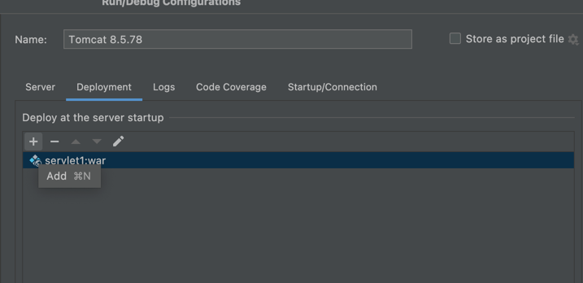
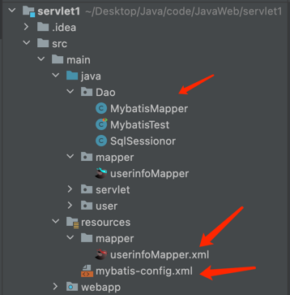
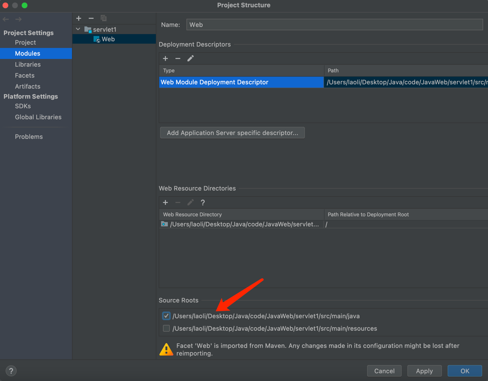
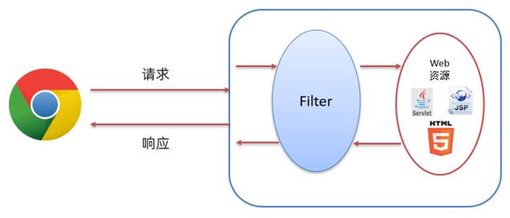

# 基于Maven整合Mabatis/servlet/vite Vue构建了一个简单的登陆注册界面前后端

## 1.maven创建及相关坐标导入
**File->new Project->maven**<br>

### pom.xml坐标导入
````xml
 <dependency>
      <groupId>junit</groupId>
      <artifactId>junit</artifactId>
      <version>4.11</version>
      <scope>test</scope>
    </dependency>
    <dependency>
      <!--导入servlet相关-->
      <groupId>javax.servlet</groupId>
      <artifactId>javax.servlet-api</artifactId>
      <version>3.1.0</version>
      <scope>provided</scope>
    </dependency>
    <dependency>
      <!--导入fastjson-->
      <groupId>com.alibaba</groupId>
      <artifactId>fastjson</artifactId>
      <version>1.2.62</version>
    </dependency>
    <dependency>
      <!--导入mybatis-->
      <groupId>org.mybatis</groupId>
      <artifactId>mybatis</artifactId>
      <version>3.5.5</version>
    </dependency>
    <dependency>
      <!--导入数据库连接驱动-->
      <groupId>mysql</groupId>
      <artifactId>mysql-connector-java</artifactId>
      <version>5.1.46</version>
    </dependency>

````
### Tomcat配置与项目打包
run->Edit configurations找到tomcat（local）
<br><br>




**到这里环境基本上配置完成了。**

## 2.Dao层mybatis的构建
首先，在数据库中新建一张user表，用于用户登录和注册。我建了一张名为userinfo的表，有id（主键自增）、username、password
三个字段。<br>
数据库表创建完成就该写mybatis的代码和配置了。mybatis相关代码路径如下<br>
要注意的是userinfoMapper接口文件要与其同名的xml构建在一个文件夹下，反正我这样的路径是没错的。<br>
先去mybatis管网上复制配置文件的代码,需要修改的信息就是dataSource和mapper里面的。如下：
````xml
<?xml version="1.0" encoding="UTF-8" ?>
<!DOCTYPE configuration
        PUBLIC "-//mybatis.org//DTD Config 3.0//EN"
        "http://mybatis.org/dtd/mybatis-3-config.dtd">
<configuration>
    <environments default="development">
        <environment id="development">
            <transactionManager type="JDBC"/>
            <dataSource type="POOLED">
                <!--数据库连接信息-->
                <property name="driver" value="com.mysql.jdbc.Driver"/>
                <property name="url" value="jdbc:mysql://47.98.177.122:3305/my_db_01"/>
                <property name="username" value="root"/>
                <property name="password" value="mima"/>
            </dataSource>
        </environment>
    </environments>
    <mappers>
        <!--加载sql映射文件,等下回来写 -->
        <mapper resource="mapper/userinfoMapper.xml"/>
    </mappers>
</configuration>
````
然后就是去写映射文件userinfo.Mapper.xml,这里也是官网复制，自己写的内容在mapper中。如下：<br>
````xml
<?xml version="1.0" encoding="UTF-8" ?>
<!DOCTYPE mapper
        PUBLIC "-//mybatis.org//DTD Mapper 3.0//EN"
        "http://mybatis.org/dtd/mybatis-3-mapper.dtd">
<!--根标签：mapper
    namespace:名称空间
-->
<!--命名空间应该填mapper接口地址-->
<mapper namespace="mapper.userinfoMapper">
    <select id="selectAll" resultType="user.User">
        select * from userinfo;
    </select>
    <insert id="insertOne">
        insert into userinfo (username,password)
        values (#{username},#{password});
    </insert>
</mapper>
````
注意：xml这里的命名空间要写同名的mapper接口地址，如上。<br>
之后写mabits的java文件，抛出mapper，如下：
```java
public class MybatisMapper {
    public static userinfoMapper mybatisor() throws IOException {
        // 1.加载mybatis核心配置文件,获取SqlSessionFactory对象
        String resource = "mybatis-config.xml";
        InputStream inputStream = Resources.getResourceAsStream(resource);
        SqlSessionFactory sqlSessionFactory = new SqlSessionFactoryBuilder().build(inputStream);
        // //2.获取sqlsession对象，执行SQL语句
        SqlSession sqlSession = sqlSessionFactory.openSession(true);
        //3.执行sql   名称空间.id
        userinfoMapper usermapper =sqlSession.getMapper(userinfoMapper.class);
        return usermapper;
    }
}
```
要注意的是````sqlSessionFactory.openSession(true);````<br>
参数true表示开启事务自动提交，不填或者填false都是开启了事务的手动提交。<br>
- 开启自动提交：自动提交好，修改数据库（增删改），数据库里面都会真实变动数据，但我们用不了事务回滚这一功能了。
- 事务手动提交：若开启，写完修改数据库（增删改）的语句后，一定要写一个commit，不然不会真实改动数据库。使用这个方法要单例抛出SqlSessionFactory对象，从该对象中获取sqlSession，进而获取mapper。不然，事务提交很难。

完整的mybatis测试插入、查询，代码如下：<br>
```java
 public void mybatisor() throws IOException {

        User user1 = new User();
        user1.setUsername("liyi");
        user1.setPassword("123456");

        // 1.加载mybatis核心配置文件,获取SqlSessionFactory对象
        String resource = "mybatis-config.xml";
        InputStream inputStream = Resources.getResourceAsStream(resource);
        SqlSessionFactory sqlSessionFactory = new SqlSessionFactoryBuilder().build(inputStream);
        //2.获取sqlsession对象，执行SQL语句
        SqlSession sqlSession = sqlSessionFactory.openSession();
        //3.执行sql   名称空间.id
        // List<User> users = sqlSession.selectList("test.selectAll");
        // System.out.println(users);
        userinfoMapper usermapper = sqlSession.getMapper(userinfoMapper.class);
        usermapper.insertOne(user1);
        List<User> users = usermapper.selectAll();
        System.out.println(users);
       //  //提交事务
        sqlSession.commit();
       //  //4.释放资源
        sqlSession.close();
       // return usermapper;
    }
```
Dao层相关差不多就这样了，还不太明白的朋友们可以看一下这篇博客：<br>
CSDN：https://mp.csdn.net/mp_blog/creation/editor/124815286 <br>
掘金：https://juejin.cn/post/7098249414631751717
## 3.servlet相关部分
项目找到File->project struct...,做下面配置直接新建servlet文件

新建servlet文件，写dopost/doget方法，接收post/get请求。示例如下：
```java
@WebServlet("/login")
public class LoginServlet extends HttpServlet {
    @Override
    protected void doGet(HttpServletRequest request, HttpServletResponse response) throws ServletException, IOException {

    }

    @Override
    protected void doPost(HttpServletRequest request, HttpServletResponse response) throws ServletException, IOException {
        System.out.println("登录成功");
    }
}
```
其中```@WebServlet("/login")```这里写的是get/post请求的地址。

**filter过滤器可以把对资源的请求拦截下来，从而实现一些特殊的功能。<br>**

登录filter部分代码
因为前端是在vue写的，所以要做下后端的跨域处理：
```java
 System.out.println("=====================跨域=======================");
        HttpServletResponse response = (HttpServletResponse) servletResponse;
        response.setHeader("Access-Control-Allow-Origin", "*");
        response.setHeader("Access-Control-Allow-Methods", "*");
        response.setHeader("Access-Control-Max-Age", "3600");
        response.setHeader("Access-Control-Allow-Headers", "*");
        response.setHeader("Access-Control-Allow-Credentials", "true");
        System.out.println("=====================注册中======================");
```
登录部分完整代码如下：
```java
 public void doFilter(ServletRequest servletRequest, ServletResponse servletResponse, FilterChain filterChain) throws IOException, ServletException {
        System.out.println("=====================跨域=======================");
        HttpServletResponse response = (HttpServletResponse) servletResponse;
        response.setHeader("Access-Control-Allow-Origin", "*");
        response.setHeader("Access-Control-Allow-Methods", "*");
        response.setHeader("Access-Control-Max-Age", "3600");
        response.setHeader("Access-Control-Allow-Headers", "*");
        response.setHeader("Access-Control-Allow-Credentials", "true");
        System.out.println("=====================注册中======================");
        //===========================接收请求体数据=============================
        String len = null;
        String message ="";
        BufferedReader body = servletRequest.getReader();
        while((len = body.readLine())!=null){
            message += len;
        }
        System.out.println(message);
        //json字符串转java对象
        User bodyuser= JSON.parseObject(message, User.class);
        System.out.println(bodyuser);
        //===========================接收请求体数据结束===========================
        // //把请求体中username取出来，为类与数据库中username比较，若相同，则注册用户名重复。
        String bodyusername = bodyuser.getUsername();
        String bodypassword = bodyuser.getPassword();

        //数据库mapper拿出来
        userinfoMapper reguserbatisor = MybatisMapper.mybatisor();
        List<User> users = reguserbatisor.selectAll();

        if(bodyusername.equals("")||bodypassword.equals("")){
            System.out.println("用户名或密码不能为空");
        }else {
            for (User user : users) {
                System.out.println("1");
                if(bodyusername.equals(user.getUsername())){
                    System.out.println("用户名重复");
                    System.out.println("==========注册失败==========");
                }else if(!bodyusername.equals(user.getUsername())){
                    System.out.println("注册中");
                    if((users.size() - 1 == users.indexOf(user))){
                        //这里避免数据重复插入数据库
                        reguserbatisor.insertOne(bodyuser);
                        //事务提交
                        filterChain.doFilter(servletRequest, servletResponse);
                    }
                }else {
                    System.out.println("未知错误，注册失败");
                }
            }
        }


    }
```
servlet部分就写到这里。
## vue+ElementPlus前端简单设计

### 概要
这部分就是用ElementPlus框架表单组件，获取相关账户名和密码，然后用axios发到后端。vue做路由处理，打开页面只有一个首页，点击进入登陆注册页面，点击注册的话进入注册页面。如下<br>

### 重点介绍
路由，就是一个组件跳到另一个主键，好比gif中点击注册切换了组件，这就是vue里面到路由跳转。<br>
路由使用的步骤：<br>
① 从 vue-router 中按需导入两个方法<br>
② 导入需要使用路由控制的组件<br>
③ 创建路由实例对象<br>
④ 向外共享路由实例对象<br>
⑤ 在 main.js 中导入并挂载路由模块<br>
```js
import { createRouter, createWebHashHistory } from 'vue-router'

import reguser from './components/reguser.vue'
import login from './components/login.vue'
const router = createRouter({
    history:createWebHashHistory(),
    routes:[
        { path: '/login', component: login },
        {path:'/reguser',component:reguser},
    ]
})

export default router
```
代码解释:<br>
createRouter可以让我们创建路由实例对象,而createWebHashHistory可以指定路由工作模式，因此要先导入这两个东西，然后导入自己写好的要用到路由的组件。
创建路由对象，其中history是指定路由工作模式（hash索引），route里面写的是路由规则。

### axios发post请求

```js
import axios from 'axios'
const app = createApp(App)
//axios.defaults.baseURL = 'http://47.98.177.122:4000'
axios.defaults.baseURL = 'http://localhost:8080/servlet1_war/' 
app.config.globalProperties.$http = axios
app.mount('#app')
```
这部分是vue里面挂载axios的方法，挂载好axios后，就可以使用axios发请求了。
```js

async onLogin(){
    const {data:res} = await this.$http.post('/login',
                        {
                            username:this.form.username,
                            password:this.form.password
                        })
    console.log(res)
}
```
这部分其实是个vue代码。axios.post返回的其实是一个promise对象，所以需要用await抛出，await抛出后，方法就需要换成异步的啦。当然，你要是用then也可以，看个人喜好吧。<br>
这里await抛出后用一个变量res接收，这里用到了es6里面的对象解构，根据键data得到值res。<br>
**vue部分知识补充见**：https://juejin.cn/post/7098903129919340575/
